# Курсовой проект «Игра "Жизнь"»

Упрощённая консольная реализация игры «Жизнь», придуманная английским математиком Джоном Конвеем в 1970 году.

## Содержание

<details>
<summary><font size="+1">1. Правила игры</font></summary><br>

Место действия игры — Вселенная. Это размеченная на клетки ограниченная плоскость.

Каждая клетка на этой плоскости может находиться в двух состояниях: быть «живой», то есть заполненной, или быть «мёртвой», то есть пустой. Клетка имеет восемь соседей, окружающих её.

Распределение живых клеток в начале игры называется первым поколением. Каждое следующее поколение рассчитывается на основе предыдущего по правилам:
1. В пустой (мёртвой) клетке, рядом с которой ровно три живых клетки, зарождается жизнь.
2. Если у живой клетки есть две или три живых соседки, то эта клетка продолжает жить. В противном случае, если соседей меньше двух или больше трёх, клетка умирает «от одиночества» или «от перенаселённости».

Игра прекращается, если:
-   на поле не останется ни одной «живой» клетки;
-   при очередном шаге ни одна из клеток не меняет своего состояния, то есть складывается стабильная конфигурация.
  
Игрок не принимает прямого участия в игре, а только расставляет начальную конфигурацию «живых» клеток, которые затем взаимодействуют согласно правилам уже без его участия. Он является наблюдателем.
</details>

<details>
<summary><font size="+1">2. Требования к решению</font></summary><br>

Реализация должна удовлетворять требованиям и ограничениям:
1. Текущее состояние Вселенной выводится на консоль в виде таблицы из символов, разделённых пробелом. Мёртвая клетка помечается символом `-`, живая клетка помечается символом `*`. Ниже приведены примеры.
2. На каждом шаге на консоль должно выводиться текущее состояние Вселенной, а также информация о номере поколения и количестве живых клеток на текущий момент.
3. При завершении игры на консоли должно присутствовать состояние Вселенной на момент окончания игры, номер поколения, количество живых клеток и причина завершения игры.
4. При расчёте состояния клеток на границах игрового поля учитываются только соседние клетки. У клеток на границе игрового поля соседних клеток будет меньше 8.
5. Для инициализации Вселенной использовать текстовый файл. Файл имеет структуру: первые два числа — это количество строк и количество столбцов в сетке Вселенной. Затем идёт информация о распределении живых клеток. Распределение состоит из неопределённого количества пар чисел, где каждая пара состоит из номера строки и номера столбца живой клетки.

Примеры входного файла, соответствующее ему начальное состояние Вселенной и конечное состояние:
</details>
<br>

<details>
<summary><font>Пример 1</font></summary><br>

```
20 30
2 3
2 4
3 4
3 5
3 6
3 7
5 0
5 1
5 2
6 2
```  
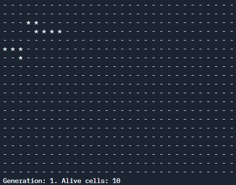
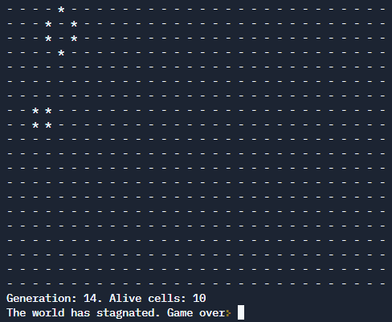
</details>

<details>
<summary><font>Пример 2</font></summary><br>

```
10 10
```  

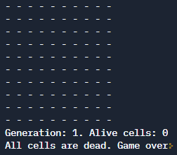
</details>

<details>
<summary><font>Пример 3</font></summary><br>

```
3 3
0 0
0 1
0 2
1 0
1 1
1 2
2 0
2 1
2 2
```  
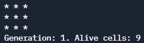
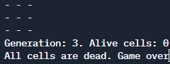
</details>
<br>

<details>
<summary><font size="+1">3. Дополнительный материал</font></summary><br>
1. При выводе на консоль каждого следующего состояния у вас никуда не денутся те состояния, которые вы выводили ранее. Это может быть полезно для сохранения истории развития вашей Вселенной, но при этом может выглядеть не совсем эстетично.
Альтернативный вариант — очищать консоль перед каждым выводом следующего состояния. Для этого можно использовать функцию `std::system` с аргументом `"clear"`, то есть вызвать функцию `std::system("clear");`. Эта функция находится в библиотеке `<cstdlib>`.
2. Компьютеры сейчас работают быстро, поэтому без дополнительных действий состояния будут сменять друг друга практически мгновенно. Для комфортного просмотра разумно добавить задержку примерно в одну секунду перед каждым следующим вычислением нового состояния. Для этого необходимо подключить библиотеку `<unistd.h>` и использовать функцию `sleep`, которая принимает на вход количество секунд, на которое надо задержаться. Для задержки на одну секунду необходимо вызвать `sleep(1);`.
</details>

<details>
<summary><font size="+1">4. Пример пошаговой работы программы</font></summary><br>

Входной файл:
```
20 30
2 3
2 4
3 4
3 5
3 6
3 7
5 0
5 1
5 2
6 2
```

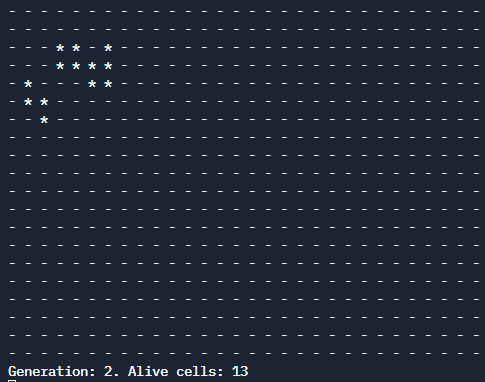
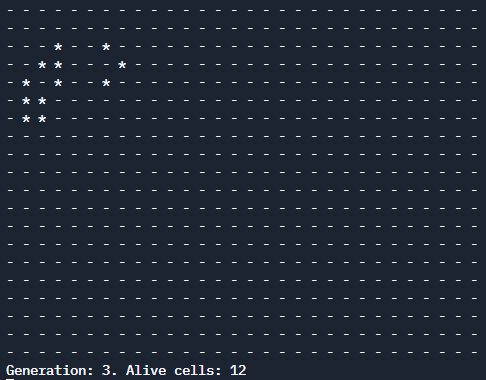
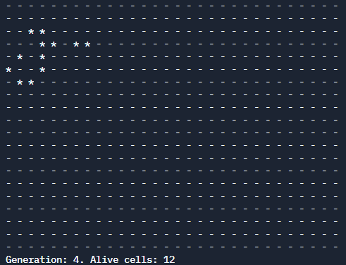
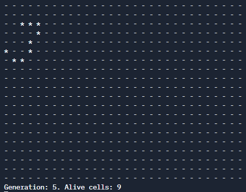
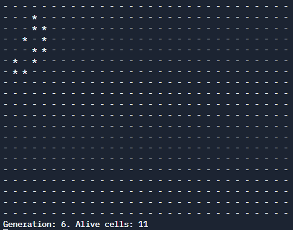
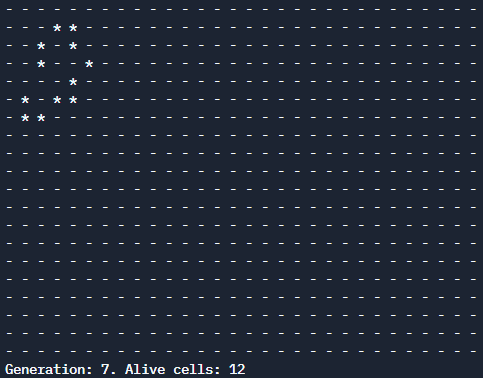
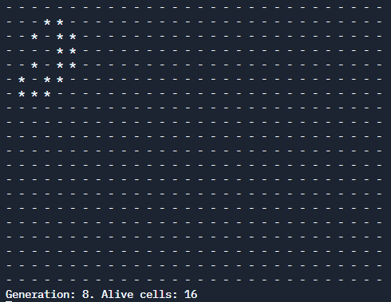
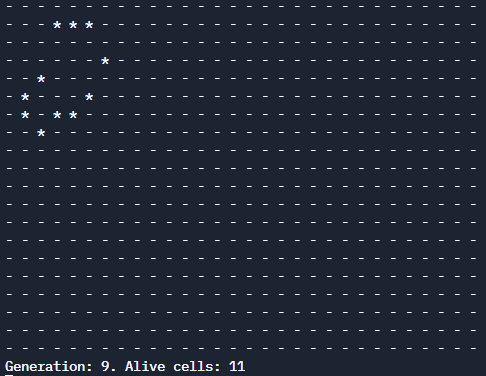
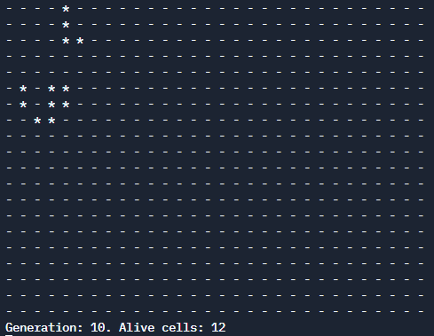
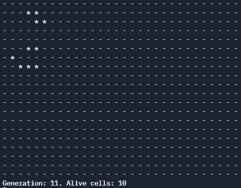
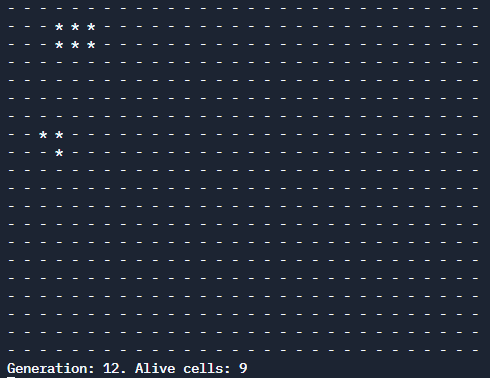
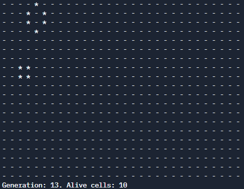

</details>
<br>


# Course project “Game of Life”

A simplified console implementation of the game "Life", invented by the English mathematician John Conway in 1970.

## Content

<details>
<summary><font size="+1">1. Rules of the game</font></summary><br>

The setting of the game is the Universe. This is a limited plane marked into cells.

Each cell on this plane can be in two states: to be “live,” that is, filled, or to be “dead,” that is, empty. A cell has eight neighbors surrounding it.

The distribution of living cells at the beginning of the game is called the first generation. Each next generation is calculated based on the previous one according to the rules:
1. In an empty (dead) cell, next to which there are exactly three living cells, life begins.
2. If a living cell has two or three living neighbors, then this cell continues to live. Otherwise, if there are fewer than two or more than three neighbors, the cell dies “from loneliness” or “from overcrowding.”

The game ends if:
- there will not be a single “living” cell left on the field;
- during the next step, none of the cells changes their state, that is, a stable configuration is formed.
  
The player does not directly participate in the game, but only arranges the initial configuration of “living” cells, which then interact according to the rules without his participation. He is an observer.
</details>

<details>
<summary><font size="+1">2. Solution requirements</font></summary><br>

The implementation must satisfy the requirements and constraints:
1. The current state of the Universe is displayed on the console in the form of a table of characters separated by a space. A dead cell is marked with the symbol `-`, a living cell is marked with the symbol `*`. Below are examples.
2. At each step, the current state of the Universe should be displayed on the console, as well as information about the generation number and the number of living cells at the current moment.
3. When finishing the game, the console must show the state of the Universe at the time the game ended, the generation number, the number of living cells and the reason for ending the game.
4. When calculating the state of cells on the boundaries of the playing field, only neighboring cells are taken into account. Cells on the border of the playing field will have less than 8 neighboring cells.
5. To initialize the Universe, use a text file. The file has a structure: the first two numbers are the number of rows and the number of columns in the Universe grid. Then comes information about the distribution of living cells. The distribution consists of an indefinite number of pairs of numbers, where each pair consists of a row number and a column number of a living cell.

Examples of an input file, the corresponding initial state of the Universe and the final state:
</details>
<br>

<details>
<summary><font>Example 1</font></summary><br>

```
20 30
2 3
2 4
3 4
3 5
3 6
3 7
5 0
5 1
5 2
6 2
``` 


</details>

<details>
<summary><font>Example 2</font></summary><br>

```
10 10
```


</details>

<details>
<summary><font>Example 3</font></summary><br>

```
3 3
0 0
0 1
0 2
1 0
1 1
1 2
2 0
2 1
2 2
```  


</details>
<br>

<details>
<summary><font size="+1">3. Additional material</font></summary><br>
1. When you output each next state to the console, the states that you output earlier will not disappear. This can be useful for preserving the history of the development of your Universe, but it may not look entirely aesthetically pleasing.
An alternative is to clear the console before each output of the next state. To do this, you can use the `std::system` function with the `"clear"` argument, that is, call the `std::system("clear");` function. This function is in the `<cstdlib>` library.
2. Computers now work quickly, so without additional actions, states will change each other almost instantly. For comfortable viewing, it is reasonable to add a delay of about one second before each next calculation of a new state. To do this, you need to include the `<unistd.h>` library and use the `sleep` function, which takes as input the number of seconds for which you need to delay. To delay one second, call `sleep(1);`.
</details>

<details>
<summary><font size="+1">4. An example of step-by-step operation of the program</font></summary><br>

Input file:
```
20 30
2 3
2 4
3 4
3 5
3 6
3 7
5 0
5 1
5 2
6 2
```


